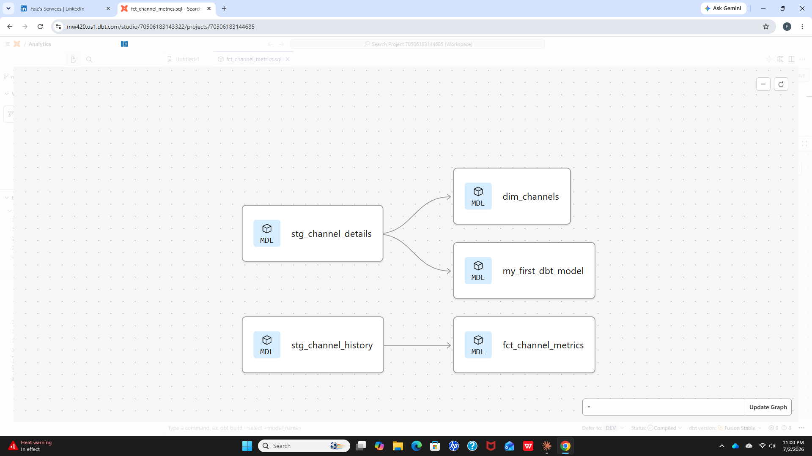
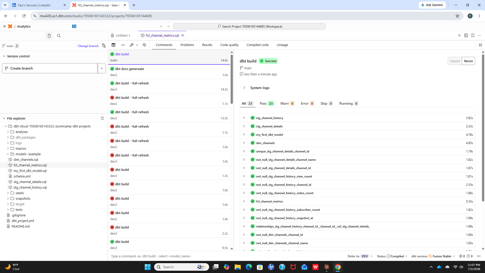

# YouTube Analytics Pipeline — dbt + BigQuery

A production-style analytics engineering project: raw YouTube channel data transformed through a 3-layer dbt architecture into a tested, documented star schema on Google BigQuery.



## What this project does

This pipeline ingests YouTube channel metadata and time-series performance snapshots, then transforms them through three layers:

1. **Sources** — raw BigQuery tables (`channel_details`, `channel_history_external`) declared and documented in dbt
2. **Staging** — light cleanup views (`stg_channel_details`, `stg_channel_history`): column renaming, type casting, reserved-word handling
3. **Marts** — a dimensional star schema:
   - `dim_channels` — one row per channel with descriptive attributes
   - `fct_channel_metrics` — one row per channel per snapshot with view/subscriber/video counts

## Architecture
```
sources (BigQuery raw)
│
▼
staging layer (views)
stg_channel_details      stg_channel_history
│                        │
▼                        ▼
marts layer (tables)
dim_channels  ◄──joins──  fct_channel_metrics
```

Modeled following Kimball dimensional modeling conventions: facts hold measures, dimensions hold context, joined on natural keys.

## Data quality: 23 automated tests

Every model is covered by dbt tests defined in `schema.yml`:

- **not_null** on all key and metric columns
- **unique** on natural keys (`channel_id` in `dim_channels`)
- **relationships** (referential integrity) — every `channel_id` in the fact table must exist in the dimension



## Tech stack

| Tool | Role |
|---|---|
| **dbt (Fusion engine)** | Transformation, testing, documentation, lineage |
| **Google BigQuery** | Cloud data warehouse |
| **SQL** | Window functions, CTEs, dimensional modeling |
| **Git / GitHub** | Version control |

## Bonus: advanced SQL analytics

On top of the pipeline, analytical queries using window functions run against the marts — including an anomaly-detection query using `LAG()`, trailing 7-day averages, `RANK()`, and CASE-based flagging:


Patterns demonstrated:
- `ROW_NUMBER() OVER (PARTITION BY ... ORDER BY ...)` — top-N per group ranking
- `LAG()` — day-over-day growth calculations
- `SUM()/AVG() OVER (ROWS BETWEEN ...)` — running totals and moving averages
- Multi-CTE query structuring for warehouse-compliant window function layering

## Project structure
```
├── models/example/
│   ├── schema.yml                 # sources, model docs, 23 tests
│   ├── stg_channel_details.sql    # staging view
│   ├── stg_channel_history.sql    # staging view
│   ├── dim_channels.sql           # dimension table
│   ├── fct_channel_metrics.sql    # fact table
│   └── my_first_dbt_model.sql     # summary model
└── dbt_project.yml                # project configuration
```

## Lessons learned

- **dbt Fusion syntax** — migrated relationship tests to the new `arguments:` format ahead of most published tutorials
- **Materialization strategy** — views for staging (cheap, always fresh), tables for marts (fast reads for joins)
- **Real debugging** — resolved materialization conflicts, YAML parsing errors, reserved-word column names (`timestamp` → `snapshot_at`), and duplicate-row data quality issues found via `GROUP BY ... HAVING COUNT(*) > 1` diagnostics
- **Warehouse constraints** — BigQuery disallows window functions nested in window ORDER BY; solved with staged CTEs

## About me

I'm Faiz Ahmad, a data engineer building modern analytics pipelines with SQL, dbt, and BigQuery. Also experienced with Docker, Terraform, Kestra, and Python ETL.

📫 [LinkedIn](https://www.linkedin.com/in/faiz-ahmad-78565852/) · Open to freelance data engineering projects
